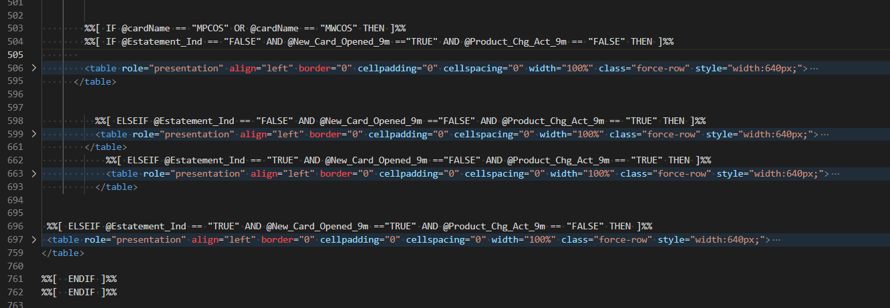
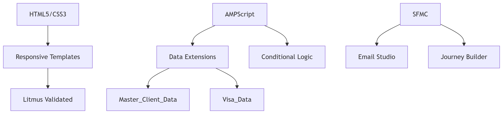

# **Project Name: Dynamic Product Offer Personalization Email Campaign**


### 🚀 **Project Overview**

This project involved the development of an advanced, **dynamically personalized email campaign** aimed at clients of a financial institution/bank
(leveraging data such as "Visa_Data", "Credit_Limit", "Product_Code"). The campaign's primary objective was to deliver highly tailored content to each 
recipient based on their profile, product history, and activity, thereby maximizing engagement and conversion for 
specific actions (e.g., opting in for an offer, updating account settings).

The campaign was implemented on the **Salesforce Marketing Cloud (SFMC)** platform, utilizing the robust
capabilities of **AMPScript** for dynamic content generation.

---

### 💡 **My Role & Responsibilities**

In this project, I served as an **Email Marketing Developer / Salesforce Marketing Cloud Developer**. My key responsibilities included:

* **Programming and coding the email template** using HTML and CSS, ensuring full responsiveness and optimal display across various devices and email clients.
* **Implementing advanced personalization logic and dynamic content** through AMPScript, based on data stored in Data Extensions.
* **Data Integration:** Retrieving and mapping customer data (such as preferred language, first name, account/product identifiers, credit card statuses, credit limits) from various sources (Data Extensions: `Master_Client_Data`, `Visa_Data`).
* **Creating Conditional Content Rules:** Utilizing AMPScript to conditionally display offers, notifications, or information blocks depending on the client's status (e.g., whether it's a newly opened card or if the client uses e-statements).
* **Cross-functional Collaboration:** Working closely with the Marketing Automation and Data Science teams to understand business requirements and data availability.
* **Testing and Optimization:** Conducting comprehensive email tests for rendering (including Litmus/Email on Acid tests), AMPScript functionality, and deliverability compliance. Implementing feedback from QA.

---

### 🛠️ **Technologies & Tools Used**

* **HTML:** Structuring and content layout of the email message.
* **CSS:** Styling and ensuring responsiveness.
* **AMPScript:** Scripting language for personalization, dynamic blocks, conditional logic, and loops.
* **Salesforce Marketing Cloud (SFMC):** Email Studio (for email building), Data Extensions (data sources).
* **Testing Tools:**  Litmus / Email on Acid (for rendering verification).

---

### 🎯 **Key Functionalities & Challenges Addressed**

This project stood out due to its advanced level of personalization, significantly enhancing its effectiveness:

* **Multi-level User Data Personalization:**
    * **Basic Data:** Retrieving `PrimaryLanguageId` (allowing for language customization) and `FirstName` (for personalized greetings) for each subscriber based on `_subscriberKey`.
    * **Product/Financial Data:** Dynamically fetching details from the `Visa_Data` Data Extension based on `Tsys_Acct_Id`, including:
        * `cardName` (product name/card type, e.g., "Visa Platinum")
        * `creditLimit` (individual credit limit)
        * `Estatement_Ind` (e-statement status – allowing, for example, to promote e-statement activation if the client hadn't enabled it)
        * `New_Card_Opened_9m` (information about new card opened within the last 9 months – enabled segmentation and offers for new clients)
        * `Product_Chg_Act_9m` (information about product change within the last 9 months – enabled segmentation and offers for clients with changed products)

* **Dynamic Content Blocks and Conditional Logic:** Based on the data retrieved via AMPScript, the email dynamically adjusted displayed sections, offers, and messages. For instance, users with `Estatement_Ind = 'N'`
* might see a section encouraging e-statement activation, while for others, this section would be hidden. Credit offers were presented in the context of their `creditLimit`.

* **Scalability and Precision:** Thanks to this elaborate logic, a single email campaign could cater to thousands of subscribers, delivering unique, relevant content to each, without the need for creating multiple separate email versions.

* **Challenge - Data Consistency:** Ensuring that all Data Extensions were properly synchronized and contained up-to-date data was crucial for flawless AMPScript personalization.

---

### 💻 **Code Snippets**

Below are key AMPScript code snippets that illustrate the personalization logic.

```ampscript
* 

* 
* 
