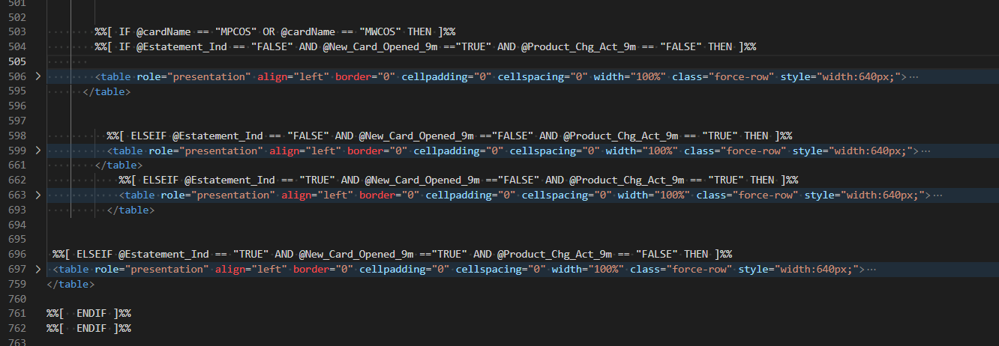
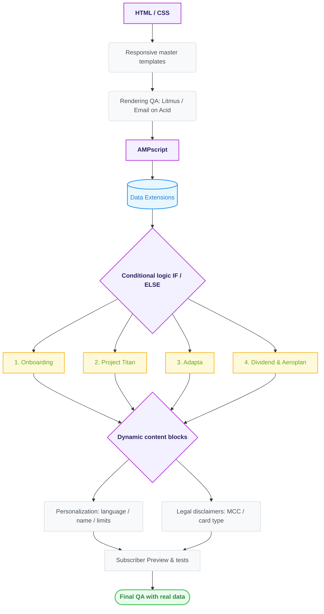
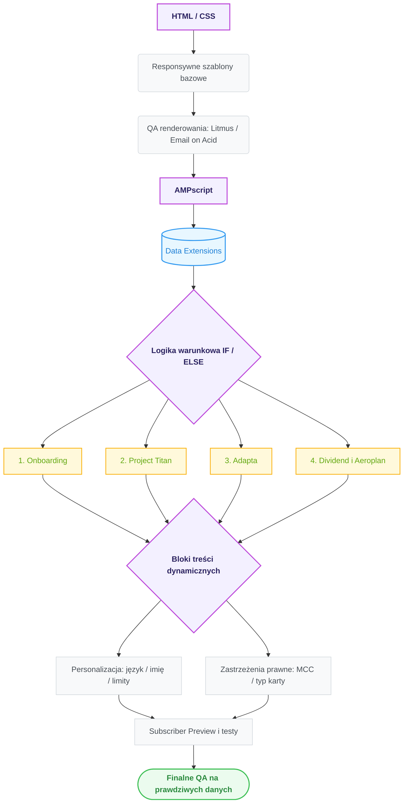

# **Cibc Email Campaigns — Case Study Portfolio**

<p align="center">
  <a href="#english-version">🇬🇧 English Version</a> │ 
  <a href="#wersja-polska">🇵🇱 Wersja Polska</a>
</p>

---

# English Version

<p align="left">
  
  
  
</p>

### 🚀 **What this project is**

A set of personalized email campaigns I built for **CIBC**, one of Canada's largest banks. My job was to turn business requirements and legal rules into email templates that automatically adapt their content to each subscriber — their name, language, card type, balance, and the legal disclaimers that apply to them.

Everything was built in **Salesforce Marketing Cloud (SFMC)**, using **AMPscript** to pull subscriber data and decide what each person sees.

---

### 💡 **My role**

I worked as an **Email Developer (Salesforce Marketing Cloud)**. In practice, that meant:

* **Building email templates from scratch** — responsive, table-based HTML with inline CSS that renders correctly in all major email clients, including older versions of Outlook.
* **Connecting templates to data** — using AMPscript functions (`Lookup`, `LookupRows`) to pull subscriber details from Data Extensions: first name, language, card status and credit limit, but also behavioral signals — eStatement status (`Estatement_Ind`), a new card opened or a product change within the last 9 months — which decided which sections and offers each client saw.
* **Writing conditional logic** — `IF/ELSE` rules that show or hide content blocks, buttons, and legal disclaimers depending on the subscriber's profile.
* **Testing with real data** — using SFMC's Subscriber Preview to switch between test records and confirm that personalization, language versions, and masked card numbers all display correctly.
* **Rendering tests** — running every template through **Litmus / Email on Acid** across hundreds of device and email client combinations.
* **Cross-team collaboration** — aligning data availability and segmentation logic with the Marketing Automation and Data Science teams, and implementing QA feedback.

---

### 🛠️ **The 4 campaigns**

#### 1. Onboarding — 4 customer segments
One master template, four different welcome journeys: *Imperial Service* (premium clients), *CIBC staff*, *standard retail clients*, and *Costco card holders*. Each segment sees a different greeting and a different set of benefits — for example, Premium Black Card perks for Imperial Service clients vs. employee banking rates for staff.

#### 2. Project Titan — lifecycle reminders (Costco Mastercard)
An automated email series sent 10, 20, and 25 days after card activation, encouraging people to sign up for online banking and eStatements.
* **Day 10 & 20:** the email detects whether the recipient is more likely a mobile or desktop user and shows either App Store / Google Play buttons or a browser login link.
* **Day 25:** a final reminder with an extra argument — switching to eStatements means no more paper filing or shredding.

#### 3. Adapta — first purchase email
A triggered email sent right after a customer's first purchase with the new Adapta Mastercard. It explains how the points work (1.5 points per dollar in the customer's top 3 spending categories, 1 point everywhere else) and how to redeem them (1,500 points = $10 toward the card balance, or 1,200 points = $10 toward CIBC investments like RRSP/TFSA).

#### 4. Dividend & Aeroplan — summer travel promotion
Promo emails in two waves (*launch* and *reminder*) encouraging travel spending.
* **Dividend (cash back):** 50% extra cash back on travel purchases, capped at $25.
* **Aeroplan (points):** 50% extra points, capped at 2,500, with separate content variants for the three card tiers (*Infinite Privilege*, *Infinite*, *Regular*).

---

### 📈 **Scale & context**

* **Budget:** each of the four campaigns ran on a budget of roughly **$50K** — around **$200K across the whole program**. At that scale, a rendering bug or a wrong disclaimer isn't a cosmetic issue, but a real financial and compliance risk.
* **Volume:** deployments of up to **100,000 recipients** per send.
* **Bilingual:** every template existed in **English and French**, with the language version selected automatically from the subscriber's language preference.
* **Segmentation via data files:** each subscriber arrived in the send file with a cell code that routed them to the correct email version (e.g., core clients, bank employees, newcomers). The inbound files followed a strict specification — fixed field order, formats, mandatory fields, and allowed values — and records failing validation were rejected before send.

---

### 📄 **Production documentation (PDF previews)**


| # | Campaign | Document |
|---|--------|----------|
| 1 | Onboarding — 4 segments | [01_CIBC_Onboarding_Segments_Spec.pdf](01_CIBC_Onboarding_Segments_Spec.pdf) |
| 2 | Project Titan — lifecycle reminders | [02_CIBC_Project_Titan_Lifecycle_Spec.pdf](02_CIBC_Project_Titan_Lifecycle_Spec.pdf) |
| 3 | Adapta — first purchase email | [03_CIBC_Adapta_First_Purchase_Spec.pdf](03_CIBC_Adapta_First_Purchase_Spec.pdf) |
| 4 | Dividend & Aeroplan — travel promotion | [04_CIBC_Dividend_Aeroplan_Travel_Spec.pdf](04_CIBC_Dividend_Aeroplan_Travel_Spec.pdf) |

> Each PDF shows the final email layouts in desktop and mobile versions, including dynamic content placeholders (`<Firstname>`, `<XXXX>`, `<OFFER END DATE>`) and the full set of legal disclaimer variants.

---

### 🎯 **The hard parts — and how I solved them**

* **Personalization at send time.** Name, language, masked card number, current balance, and credit limit are all pulled from Data Extensions the moment the email is sent — nothing is hardcoded.
* **Legal disclaimers.** Banking emails require precise legal footers, and the right one depends on the card the recipient holds. The template automatically picks the correct disclaimer variant (based on Merchant Category Codes and card type) and hides everything that doesn't apply.
* **One template instead of dozens.** Thanks to conditional content blocks, a single master template covers all segments and card variants. Without it, the team would have to maintain dozens of near-identical static copies.
* **Error-proofing.** Bank data feeds aren't always clean. I added fallbacks for empty (`null`) or badly formatted fields, so a broken record never breaks the email or stops the send.

---

### 💻 **Code snippets**

An excerpt from the production code (environment IDs and content block IDs masked). This is the header block that prepares all personalization variables before the email body renders. It parses card data delivered as an escaped JSON string, looks up the subscriber's language, name and product code, formats the points balance and balance date for both English and French (`fr-CA`) locales, calculates the dollar value of the points (1,500 points = $10), and selects the correct unsubscribe configuration depending on the environment (PROD / UAT / DEV):

```html
%%[ /* Initial AMPScript Block <div style="display: none;">*/

  VAR @unsubID, @primaryLanguageID, @lang, @x_lang, @title, @firstName, @subKey, @productCode
  VAR @Visa_Data_Complete

  SET @subKey = AttributeValue("SubscriberKey")

  /* Card data arrives as an escaped JSON string - clean it up and parse into a rowset */
  SET @Visa_Data_Complete = Replace([Visa_Data_Complete], Concat(char(34),char(34)), char(34))
  SET @Visa_Data_Complete = Replace(@Visa_Data_Complete, Concat(char(34),"["),"[")
  SET @Visa_Data_Complete = Replace(@Visa_Data_Complete, Concat("]",char(34)),"]")
  SET @VDC_JSON = BuildRowsetFromJson(@Visa_Data_Complete,'$[*]',1)
  SET @Tsys_Acct_Id = Field(Row(@VDC_JSON, 1),"Tsys_Acct_Id")
  SET @Tsys_Acct_Id = FormatNumber(@Tsys_Acct_Id,"F0")

  SET @primaryLanguageID = Lookup(
    "Master_Client_Data",
    "PrimaryLanguageId",
    "Person_Contact_Id",
    @subKey
  )

  SET @firstName = Lookup(
    "Master_Client_Data",
    "FirstName",
    "Person_Contact_Id",
    @subKey
  )

  SET @productCode = Lookup(
    "Master_Client_Data",
    "Product_Code",
    "Person_Contact_Id",
    @subKey
  )

/* </div> */]%%

<script runat=server>

  Platform.Load("Core","1");
  Platform.Function.ContentBlockByID("XXXXX");

  var stringsToFormat = ["firstName"];

  for(var index in stringsToFormat) {
    var output = formatName(Variable.GetValue(stringsToFormat[index]));
    Variable.SetValue(stringsToFormat[index],output);
  }

</script>
%%[ /* Initial AMPScript Block <div style="display: none;">*/

  /* Points balance and converter */
  VAR @points_balance, @points_balance_en, @points_balance_fr
  VAR @balance_date, @balance_date_en, @balance_date_fr

  SET @points_balance = Lookup(
    "Visa_Data",
    "Point_Bal",
    "Tsys_Acct_Id",
    @Tsys_Acct_Id
  )

  SET @points_balance_en = FormatNumber(@points_balance, "C0")
  SET @points_balance_fr = FormatNumber(@points_balance, "C0", "fr-CA")

  SET @points_balance_en = Replace(@points_balance_en, "$", "")
  SET @points_balance_fr = Replace(@points_balance_fr, " $", "")

  SET @points_converter_en = Multiply(@points_balance, 10)
  SET @points_converter_en = Divide(@points_converter_en, 1500)
  SET @points_converter_en = FormatNumber(@points_converter_en, "F0")

  SET @today = Now(1)
  SET @balance_date = DateAdd(@today, -2, "D")
  SET @balance_date_en = FormatDate(@balance_date, "MMMM d, yyyy")
  SET @balance_date_fr = FormatDate(@balance_date, "d MMMM yyyy", , "fr-CA")

  SET @balance_date_en = Replace(@balance_date_en, " ", "&nbsp;")
  SET @balance_date_fr = Replace(@balance_date_fr, " ", "&nbsp;")

  /* Language routing: subject line and content language per subscriber */
  IF @primaryLanguageId == "F" THEN

    SET @lang = "fr"
    SET @title = Concat(@firstName, ", vous êtes prêt à échanger vos points 🥳")

  ELSE

    SET @lang = "en"
    SET @title = Concat(@firstName, ", you’re ready to redeem 🥳")

  ENDIF

  /* Email logic */
  SET @prefix = TreatAsContent("%%emailname_%%_%%=Uppercase(@productCode)=%%_%%=Uppercase(@lang)=%%")

  /* Unsubscribe configuration per environment (MIDs masked) */
  /* CIBC_PROD */
  IF memberid == "52600XXXX" THEN
    SET @unsubID = "13"

  /* CIBC_SIT_UAT */
  ELSEIF memberid == "52600XXXX" THEN
    SET @unsubID = "8"

  /* CIBC_DEV */
  ELSEIF memberid == "52600XXXX" THEN
    SET @unsubID = "2"

  /* CIBC_SIT_UAT 2 */
  ELSEIF memberid == "53400XXXX" THEN
    SET @unsubID = "21"
  ENDIF

/* </div> */ ]%%
```

A few details worth noticing:

* **`BuildRowsetFromJson` + `Replace` chain** — the card data arrived as a JSON string with escaped quotes, so it had to be cleaned before parsing.
* **Locale-aware formatting** — numbers and dates are formatted separately for `en` and `fr-CA`, including the different currency symbol placement in French.
* **`&nbsp;` in dates** — spaces in formatted dates are replaced with non-breaking spaces so the date never wraps mid-line on mobile.
* **Environment-aware unsubscribe** — the same template runs in PROD, UAT and DEV, picking the right unsubscribe configuration by account ID.

<!-- Screenshots of the actual implementation (anonymized) can go here:
<p align="left">
  
  
</p>
-->

---

### 🛠️ **Tools**

* **HTML / CSS (email-specific):** table-based layouts, inline styles, media queries.
* **AMPscript:** data lookups, conditional blocks, formatting.
* **Salesforce Marketing Cloud:** Content Builder, Data Extensions.
* **Litmus / Email on Acid:** rendering tests across devices and clients.

---

### 📊 **How it all fits together**


```mermaid
graph TD
    A[HTML / CSS] --> B(Responsive master templates)
    B --> C(Rendering QA: Litmus / Email on Acid)

    C --> D[AMPscript]
    D --> E[(Data Extensions)]
    E --> F{Conditional logic IF / ELSE}
    
    F --> G[1. Onboarding]
    F --> H[2. Project Titan]
    F --> I[3. Adapta]
    F --> J[4. Dividend & Aeroplan]

    G & H & I & J --> K{Dynamic content blocks}
    K --> L[Personalization: language / name / limits]
    K --> M[Legal disclaimers: MCC / card type]

    L & M --> N[Subscriber Preview & tests]
    N --> O([Final QA with real data])

    classDef tech fill:#f3f0ff,stroke:#be4bdb,stroke-width:2px,color:#2b2261,font-weight:bold;
    classDef project fill:#fff9db,stroke:#fab005,stroke-width:1.5px,color:#66a80f;
    classDef process fill:#f8f9fa,stroke:#ced4da,stroke-width:1px,color:#495057;
    classDef database fill:#e8f7ff,stroke:#339af0,stroke-width:2px,color:#1c7ed6;
    classDef success fill:#ebfbee,stroke:#40c057,stroke-width:2px,color:#2b8a3e,font-weight:bold;

    class A,D,F,K tech;
    class G,H,I,J project;
    class B,C,L,M,N process;
    class E database;
    class O success;
```

<p align="right">
  <a href="#english-version">⬆️ Back to top</a>
</p>

---

# Wersja Polska

<p align="left">
  
  
  
</p>

### 🚀 **Czym jest ten projekt**

Zestaw spersonalizowanych kampanii e-mailowych, które zbudowałam dla **CIBC** — jednego z największych banków w Kanadzie. Moim zadaniem było przełożenie wymagań biznesowych i reguł prawnych na szablony e-maili, które same dopasowują treść do każdego odbiorcy: jego imienia, języka, typu karty, salda i zastrzeżeń prawnych, które go dotyczą.

Wszystko powstało w **Salesforce Marketing Cloud (SFMC)**, z użyciem **AMPscript** do pobierania danych subskrybenta i decydowania, co kto zobaczy.

---

### 💡 **Moja rola**

Pracowałam jako **Email Developer (Salesforce Marketing Cloud)**. W praktyce oznaczało to:

* **Budowanie szablonów e-mail od zera** — responsywny HTML oparty na tabelach, ze stylami inline, który poprawnie wyświetla się we wszystkich głównych klientach poczty, łącznie ze starszymi wersjami Outlooka.
* **Łączenie szablonów z danymi** — funkcje AMPscript (`Lookup`, `LookupRows`) pobierające dane subskrybenta z Data Extensions: imię, język, status karty i limit kredytowy, ale też sygnały behawioralne — status eStatements (`Estatement_Ind`), otwarcie nowej karty czy zmiana produktu w ostatnich 9 miesiącach — które decydowały, jakie sekcje i oferty zobaczy dany klient.
* **Pisanie logiki warunkowej** — reguły `IF/ELSE`, które pokazują lub ukrywają bloki treści, przyciski i zastrzeżenia prawne w zależności od profilu odbiorcy.
* **Testy na prawdziwych danych** — Subscriber Preview w SFMC i przełączanie rekordów testowych, żeby sprawdzić, czy personalizacja, wersje językowe i maskowane numery kart wyświetlają się poprawnie.
* **Testy renderowania** — każdy szablon przechodził przez **Litmus / Email on Acid** na setkach kombinacji urządzeń i klientów poczty.
* **Współpraca z innymi zespołami** — uzgadnianie dostępności danych i logiki segmentacji z zespołami Marketing Automation i Data Science oraz wdrażanie poprawek z QA.

---

### 🛠️ **Cztery kampanie**

#### 1. Onboarding — 4 segmenty klientów
Jeden szablon bazowy, cztery różne ścieżki powitalne: *Imperial Service* (klienci premium), *pracownicy CIBC*, *standardowi klienci detaliczni* i *posiadacze karty Costco*. Każdy segment widzi inne powitanie i inny zestaw korzyści — np. benefity Premium Black Card dla klientów Imperial Service vs. preferencyjne stawki pracownicze dla zatrudnionych w banku.

#### 2. Project Titan — przypomnienia w cyklu życia (Costco Mastercard)
Automatyczna seria e-maili wysyłanych 10, 20 i 25 dni po aktywacji karty, zachęcająca do założenia bankowości internetowej i włączenia eStatements (wyciągów elektronicznych).
* **Dzień 10 i 20:** e-mail rozpoznaje, czy odbiorca to raczej użytkownik mobilny czy desktopowy, i pokazuje albo przyciski App Store / Google Play, albo link do logowania w przeglądarce.
* **Dzień 25:** ostatnie przypomnienie z dodatkowym argumentem — przejście na eStatements to koniec segregowania i niszczenia papierowych wyciągów.

#### 3. Adapta — e-mail po pierwszym zakupie
E-mail wyzwalany automatycznie zaraz po pierwszej transakcji nową kartą Adapta Mastercard. Tłumaczy, jak działają punkty (1,5 punktu za dolara w 3 najczęstszych kategoriach wydatków klienta, 1 punkt za resztę) i jak je wymieniać (1 500 punktów = 10 $ na spłatę karty albo 1 200 punktów = 10 $ na inwestycje CIBC typu RRSP/TFSA).

#### 4. Dividend i Aeroplan — letnia promocja podróżnicza
E-maile promocyjne w dwóch falach (*launch* i *reminder*), zachęcające do wydatków na podróże.
* **Dividend (cash back):** 50% więcej cash backu za zakupy podróżnicze, maksymalnie 25 $.
* **Aeroplan (punkty):** 50% więcej punktów, maksymalnie 2 500, z osobnymi wariantami treści dla trzech poziomów kart (*Infinite Privilege*, *Infinite*, *Regular*).

---

### 📈 **Skala i kontekst**

* **Budżet:** każda z czterech kampanii działała w budżecie rzędu **50 tys. $** — łącznie ok. **200 tys. $** na cały program. Przy takiej skali błąd renderowania czy niewłaściwy disclaimer to nie problem kosmetyczny, tylko realne ryzyko finansowe i compliance.
* **Wolumen:** wysyłki do **100 000 odbiorców** na deployment.
* **Dwujęzyczność:** każdy szablon istniał po **angielsku i francusku**, a wersja językowa była dobierana automatycznie na podstawie preferencji subskrybenta.
* **Segmentacja przez pliki danych:** każdy subskrybent trafiał do pliku wysyłkowego z kodem segmentu, który kierował go do właściwej wersji e-maila (np. klienci standardowi, pracownicy banku, nowi klienci). Pliki wejściowe miały ścisłą specyfikację — stałą kolejność pól, formaty, pola obowiązkowe i dozwolone wartości — a rekordy niespełniające walidacji były odrzucane przed wysyłką.

---

### 📄 **Dokumentacja produkcyjna (podglądy PDF)**


| # | Kampania | Dokument |
|---|-------|----------|
| 1 | Onboarding — 4 segmenty | [01_CIBC_Onboarding_Segments_Spec.pdf](01_CIBC_Onboarding_Segments_Spec.pdf) |
| 2 | Project Titan — przypomnienia w cyklu życia | [02_CIBC_Project_Titan_Lifecycle_Spec.pdf](02_CIBC_Project_Titan_Lifecycle_Spec.pdf) |
| 3 | Adapta — e-mail po pierwszym zakupie | [03_CIBC_Adapta_First_Purchase_Spec.pdf](03_CIBC_Adapta_First_Purchase_Spec.pdf) |
| 4 | Dividend i Aeroplan — promocja podróżnicza | [04_CIBC_Dividend_Aeroplan_Travel_Spec.pdf](04_CIBC_Dividend_Aeroplan_Travel_Spec.pdf) |

> Każdy PDF pokazuje finalne layouty e-maili w wersji desktop i mobile, wraz z placeholderami treści dynamicznych (`<Firstname>`, `<XXXX>`, `<OFFER END DATE>`) i pełnym zestawem wariantów zastrzeżeń prawnych.

---

### 🎯 **Co było trudne — i jak to rozwiązałam**

* **Personalizacja w momencie wysyłki.** Imię, język, maskowany numer karty, saldo i limit kredytowy są pobierane z Data Extensions dokładnie w chwili wysyłki — nic nie jest wpisane na sztywno.
* **Zastrzeżenia prawne.** E-maile bankowe wymagają precyzyjnych stopek prawnych, a właściwa zależy od karty odbiorcy. Szablon sam dobiera odpowiedni wariant (na podstawie kodów MCC i typu karty) i ukrywa wszystko, co nie dotyczy danej osoby.
* **Jeden szablon zamiast dziesiątek.** Dzięki blokom treści warunkowych jeden szablon bazowy obsługuje wszystkie segmenty i warianty kart. Bez tego zespół musiałby utrzymywać dziesiątki niemal identycznych statycznych kopii.
* **Odporność na błędy.** Dane z systemów bankowych nie zawsze są czyste. Dodałam fallbacki dla pustych (`null`) lub źle sformatowanych pól, żeby uszkodzony rekord nigdy nie zepsuł e-maila ani nie zatrzymał wysyłki.

---

### 💻 **Fragmenty kodu**

Fragment kodu produkcyjnego (identyfikatory środowisk i bloków treści zamaskowane). To blok nagłówkowy, który przygotowuje wszystkie zmienne personalizacyjne, zanim wyrenderuje się treść e-maila. Parsuje dane karty dostarczone jako escapowany string JSON, pobiera język, imię i kod produktu subskrybenta, formatuje saldo punktów i datę salda dla wersji angielskiej i francuskiej (`fr-CA`), przelicza wartość punktów na dolary (1 500 punktów = 10 $) i dobiera właściwą konfigurację wypisu z subskrypcji w zależności od środowiska (PROD / UAT / DEV):

```html
%%[ /* Initial AMPScript Block <div style="display: none;">*/

  VAR @unsubID, @primaryLanguageID, @lang, @x_lang, @title, @firstName, @subKey, @productCode
  VAR @Visa_Data_Complete

  SET @subKey = AttributeValue("SubscriberKey")

  /* Card data arrives as an escaped JSON string - clean it up and parse into a rowset */
  SET @Visa_Data_Complete = Replace([Visa_Data_Complete], Concat(char(34),char(34)), char(34))
  SET @Visa_Data_Complete = Replace(@Visa_Data_Complete, Concat(char(34),"["),"[")
  SET @Visa_Data_Complete = Replace(@Visa_Data_Complete, Concat("]",char(34)),"]")
  SET @VDC_JSON = BuildRowsetFromJson(@Visa_Data_Complete,'$[*]',1)
  SET @Tsys_Acct_Id = Field(Row(@VDC_JSON, 1),"Tsys_Acct_Id")
  SET @Tsys_Acct_Id = FormatNumber(@Tsys_Acct_Id,"F0")

  SET @primaryLanguageID = Lookup(
    "Master_Client_Data",
    "PrimaryLanguageId",
    "Person_Contact_Id",
    @subKey
  )

  SET @firstName = Lookup(
    "Master_Client_Data",
    "FirstName",
    "Person_Contact_Id",
    @subKey
  )

  SET @productCode = Lookup(
    "Master_Client_Data",
    "Product_Code",
    "Person_Contact_Id",
    @subKey
  )

/* </div> */]%%

<script runat=server>

  Platform.Load("Core","1");
  Platform.Function.ContentBlockByID("XXXXX");

  var stringsToFormat = ["firstName"];

  for(var index in stringsToFormat) {
    var output = formatName(Variable.GetValue(stringsToFormat[index]));
    Variable.SetValue(stringsToFormat[index],output);
  }

</script>
%%[ /* Initial AMPScript Block <div style="display: none;">*/

  /* Points balance and converter */
  VAR @points_balance, @points_balance_en, @points_balance_fr
  VAR @balance_date, @balance_date_en, @balance_date_fr

  SET @points_balance = Lookup(
    "Visa_Data",
    "Point_Bal",
    "Tsys_Acct_Id",
    @Tsys_Acct_Id
  )

  SET @points_balance_en = FormatNumber(@points_balance, "C0")
  SET @points_balance_fr = FormatNumber(@points_balance, "C0", "fr-CA")

  SET @points_balance_en = Replace(@points_balance_en, "$", "")
  SET @points_balance_fr = Replace(@points_balance_fr, " $", "")

  SET @points_converter_en = Multiply(@points_balance, 10)
  SET @points_converter_en = Divide(@points_converter_en, 1500)
  SET @points_converter_en = FormatNumber(@points_converter_en, "F0")

  SET @today = Now(1)
  SET @balance_date = DateAdd(@today, -2, "D")
  SET @balance_date_en = FormatDate(@balance_date, "MMMM d, yyyy")
  SET @balance_date_fr = FormatDate(@balance_date, "d MMMM yyyy", , "fr-CA")

  SET @balance_date_en = Replace(@balance_date_en, " ", "&nbsp;")
  SET @balance_date_fr = Replace(@balance_date_fr, " ", "&nbsp;")

  /* Language routing: subject line and content language per subscriber */
  IF @primaryLanguageId == "F" THEN

    SET @lang = "fr"
    SET @title = Concat(@firstName, ", vous êtes prêt à échanger vos points 🥳")

  ELSE

    SET @lang = "en"
    SET @title = Concat(@firstName, ", you’re ready to redeem 🥳")

  ENDIF

  /* Email logic */
  SET @prefix = TreatAsContent("%%emailname_%%_%%=Uppercase(@productCode)=%%_%%=Uppercase(@lang)=%%")

  /* Unsubscribe configuration per environment (MIDs masked) */
  /* CIBC_PROD */
  IF memberid == "52600XXXX" THEN
    SET @unsubID = "13"

  /* CIBC_SIT_UAT */
  ELSEIF memberid == "52600XXXX" THEN
    SET @unsubID = "8"

  /* CIBC_DEV */
  ELSEIF memberid == "52600XXXX" THEN
    SET @unsubID = "2"

  /* CIBC_SIT_UAT 2 */
  ELSEIF memberid == "53400XXXX" THEN
    SET @unsubID = "21"
  ENDIF

/* </div> */ ]%%
```

Kilka szczegółów wartych uwagi:

* **`BuildRowsetFromJson` + łańcuch `Replace`** — dane karty przychodziły jako string JSON z escapowanymi cudzysłowami, więc przed parsowaniem trzeba było je oczyścić.
* **Formatowanie zależne od locale** — liczby i daty są formatowane osobno dla `en` i `fr-CA`, łącznie z innym położeniem symbolu waluty po francusku.
* **`&nbsp;` w datach** — spacje w sformatowanych datach są zamieniane na twarde spacje, żeby data nigdy nie łamała się w połowie na mobile.
* **Wypis zależny od środowiska** — ten sam szablon działa na PROD, UAT i DEV, dobierając konfigurację unsubscribe po ID konta.

<!-- Tutaj mogą trafić screenshoty faktycznej implementacji (zanonimizowane):
<p align="left">
  
  
</p>
-->

---

### 🛠️ **Narzędzia**

* **HTML / CSS (pod e-mail):** layouty oparte na tabelach, style inline, media queries.
* **AMPscript:** pobieranie danych, bloki warunkowe, formatowanie.
* **Salesforce Marketing Cloud:** Content Builder, Data Extensions.
* **Litmus / Email on Acid:** testy renderowania na urządzeniach i klientach poczty.

---

### 📊 **Jak to się składa w całość**


```mermaid
graph TD
    A[HTML / CSS] --> B(Responsywne szablony bazowe)
    B --> C(QA renderowania: Litmus / Email on Acid)

    C --> D[AMPscript]
    D --> E[(Data Extensions)]
    E --> F{Logika warunkowa IF / ELSE}
    
    F --> G[1. Onboarding]
    F --> H[2. Project Titan]
    F --> I[3. Adapta]
    F --> J[4. Dividend i Aeroplan]

    G & H & I & J --> K{Bloki treści dynamicznych}
    K --> L[Personalizacja: język / imię / limity]
    K --> M[Zastrzeżenia prawne: MCC / typ karty]

    L & M --> N[Subscriber Preview i testy]
    N --> O([Finalne QA na prawdziwych danych])

    classDef tech fill:#f3f0ff,stroke:#be4bdb,stroke-width:2px,color:#2b2261,font-weight:bold;
    classDef project fill:#fff9db,stroke:#fab005,stroke-width:1.5px,color:#66a80f;
    classDef process fill:#f8f9fa,stroke:#ced4da,stroke-width:1px,color:#495057;
    classDef database fill:#e8f7ff,stroke:#339af0,stroke-width:2px,color:#1c7ed6;
    classDef success fill:#ebfbee,stroke:#40c057,stroke-width:2px,color:#2b8a3e,font-weight:bold;

    class A,D,F,K tech;
    class G,H,I,J project;
    class B,C,L,M,N process;
    class E database;
    class O success;
```

<p align="right">
  <a href="#wersja-polska">⬆️ Powrót na górę</a>
</p>
