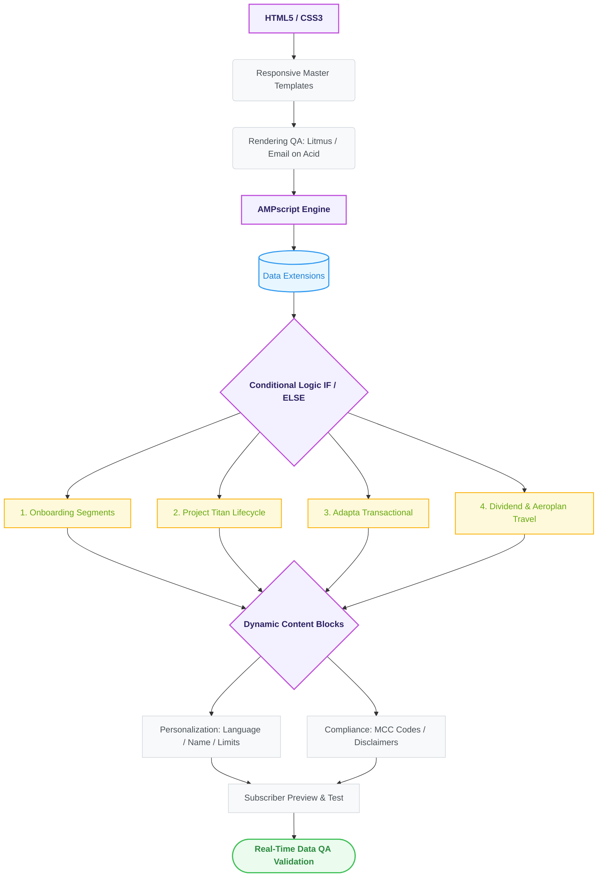
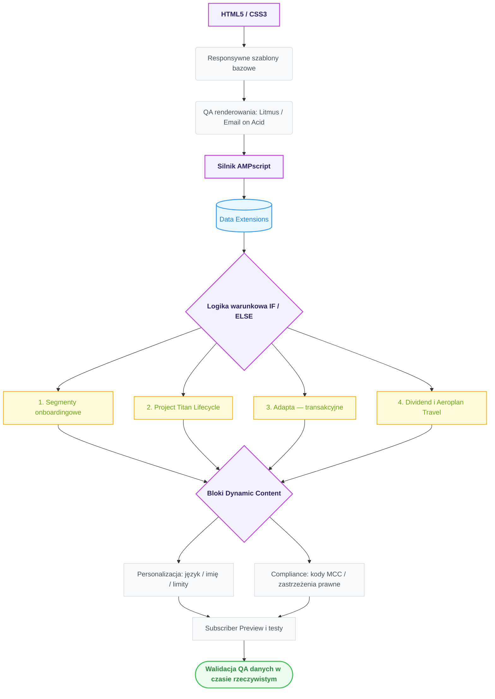

# **Enterprise Lifecycle & Promotional Marketing Automation (CIBC Case Study Portfolio)**

  <a href="#english-version">🇬🇧 English Version</a> │ 
  <a href="#wersja-polska">🇵🇱 Wersja Polska</a>

---

# English Version

  
  
  

### 🚀 **Project Overview**

This project showcases a comprehensive portfolio of advanced, **dynamically personalized email marketing campaigns** developed for a major Canadian financial institution (**CIBC**). The production lifecycle involved translating strict corporate business requirements, financial matrices, and legal rules from production specifications into highly adaptive, data-driven automated communication flows.

The entire template framework was architected and executed within the **Salesforce Marketing Cloud (SFMC)** platform, leveraging **AMPscript** for real-time logical routing, variable parsing, and structural data-mapping to serve unique content blocks per subscriber layout context.

---

### 💡 **My Role & Responsibilities**

In this comprehensive initiative, I served as the **Email Marketing Developer / Salesforce Marketing Cloud Developer**. My key responsibilities included:

* **Template Architecture & Programming:** Coding robust, cross-client responsive email templates from scratch in Content Builder utilizing HTML table standards (`<table>`, `<tr>`, `<td>`) and optimized inline CSS configurations to prevent rendering breakdown on rigid email clients.
* **Data Mapping & Retrieval (Data Extensions):** Utilizing AMPscript lookup and relational functions (such as `Lookup` and `LookupRows`) to seamlessly pull client metrics (e.g., preference tags, credit card statuses, transactional milestones, and credit limits) directly from Data Extensions into the template environment.
* **Designing Conditional Content Rules:** Programming nested logical blocks (`IF/ELSE/ELSEIF`) to systematically target specific user segments, automatically rendering or concealing visual elements, calls-to-action (CTAs), and financial data vectors based on active profiles.
* **Data Validation & Simulation (Subscriber Preview & QA):** Utilizing SFMC preview utilities to simulate template behavior in real time. By dynamically switching test records within Data Extensions, I verified that the AMPscript engine correctly processed variables, injected appropriate language localizations, properly masked credit card tokens, and seamlessly swapped text arrays upon subscriber swap.
* **Rendering Optimization & Testing:** Conducting extensive visual testing across hundreds of device and engine configurations (including legacy Outlook desktop, webmails, and mobile Gmail/Apple Mail apps) using **Email on Acid / Litmus** to eliminate layout decay.

---

### 🛠️ **Production Modules (Campaigns Handled)**

My core engineering scope was divided into four highly specific production modules, which served as the foundation for execution:

#### 1. CIBC Onboarding Segments (Imperial Service, Staff, Retail)
* **Execution Scope:** Programmed template rules to adapt a master onboarding shell into four distinct user journeys: *Imperial Service High-Net-Worth* (Email 1), *Corporate Staff Perks* (Email 2), *Standard Retail Channels* (Email 3), and *Costco Co-branded Onboarding* (Email 4).
* **Logic Implemented:** Real-time generation of custom greetings and the conditional display of exclusive product features (e.g., Premium Black Card benefits vs. Employee Banking rates) based on internal profile attributes pulled from the subscriber record.

#### 2. Project Titan: Behavioral Lifecycle Automation (Costco Mastercard)
* **Execution Scope:** Built a multi-tier, automated drip communication matrix tracking credit card activation thresholds across specific lifecycle touchpoints (Day 10, Day 20, and Day 25 milestones).
* **Logic Implemented:** 
  * **Day 10 & 20 Segment (`NO OLB/MB & YES ESTATEMENTS`):** Evaluated subscriber data to conditionally serve responsive App Store/Google Play download blocks for mobile prospects OR browser-based login triggers for desktop users.
  * **Day 25 Segment (`NO OLB/MB & NO ESTATEMENTS`):** Designed an automated reminder intercept that conditionally injected eco-friendly value propositions ("Help the environment - no more paper filing or shredding") to drive digital statement adoption.

#### 3. CIBC Adapta: Triggered Transaction Activation
* **Execution Scope:** Engineered a real-time, transaction-triggered (event-driven) email template reacting immediately following a subscriber's first purchase event on the new Adapta Mastercard.
* **Logic Implemented:** Embedded AMPscript equations outlining points accumulation matrices (1.5 points for top 3 variable spending tiers, 1 point for general transactions) and dynamic cash-back valuation modules presenting redemption options (e.g., 1,500 points = $10 statement credit vs. 1,200 points = $10 investment redirection into RRSP/TFSA).

#### 4. CIBC Dividend & Aeroplan: Seasonal Travel Promotions
* **Execution Scope:** Developed high-volume promotional modules configured across two deployment stages (*Launch* and *Reminder*) aimed at driving summer travel expenditures for Dividend (Cash Back) and Aeroplan (Frequent Flyer Miles) account holders.
* **Logic Implemented:** 
  * **Dividend Track:** Programmed data parsing filters displaying available cash back caps while managing an automated 50% bonus logic ceiling restricted to a strict $25 threshold.
  * **Aeroplan Track:** Segmented communication layouts dynamically across three portfolio levels (*Infinite Privilege*, *Infinite*, *Regular*) to automatically bind a 50% points accelerator up to a maximum cap of 2,500 bonus points.

---

### 📄 **Production Documentation (PDF Previews)**

Final rendered previews (desktop & mobile layouts) of the production templates for each module are available in the [`/docs`](docs) folder:

| # | Module | Document |
|---|--------|----------|
| 1 | Onboarding Segments (Imperial Service, Staff, Retail, Costco) | [01_CIBC_Onboarding_Segments_Spec.pdf](01_CIBC_Onboarding_Segments_Spec.pdf) |
| 2 | Project Titan: Behavioral Lifecycle (Day 10 / 20 / 25) | [02_CIBC_Project_Titan_Lifecycle_Spec.pdf](02_CIBC_Project_Titan_Lifecycle_Spec.pdf) |
| 3 | Adapta: First Purchase Acknowledgment (Triggered) | [03_CIBC_Adapta_First_Purchase_Spec.pdf](03_CIBC_Adapta_First_Purchase_Spec.pdf) |
| 4 | Dividend & Aeroplan: Travel Spend & Get (Launch + Reminder) | [04_CIBC_Dividend_Aeroplan_Travel_Spec.pdf](04_CIBC_Dividend_Aeroplan_Travel_Spec.pdf) |

> Each PDF contains both desktop and mobile renderings of the final email layouts, including dynamic content placeholders (`<Firstname>`, `<XXXX>`, `<OFFER END DATE>`) and the full legal disclaimer variants driven by conditional logic.

---

### 🎯 **Key Functionalities & Challenges Addressed**

This project stood out due to its advanced level of data-driven personalization, solving multiple critical architecture challenges:

* **Multi-level User Data Personalization:**
  * **Core Profile Ingestion:** Safely retrieving preference tokens (`PrimaryLanguageId` for real-time localization) and name parameters (`FirstName`) mapped securely from the system's `_subscriberKey`.
  * **Financial Portfolio Evaluation:** Pulling active portfolio records from `Visa_Data` via structural identifiers (`Tsys_Acct_Id`) to mask and format credit numbers (`<XXXX>`), calculate balance metrics (`<MMMM DD, YYYY>`), and populate conditional spending caps (`creditLimit`).
* **Legal Compliance Automation:** In the banking sector, the disclaimer footer is a critical component. I built complex conditional content rules that programmatically cross-referenced **Merchant Category Codes (MCC)** in the background. The AMPscript engine systematically swapped dense legal disclaimers (such as tiered cashback limitations or travel exclusion metrics) while completely hiding irrelevant text variants depending on the active product card.
* **Scalability Over Duplication:** By leveraging granular conditional logic gates and Dynamic Content Blocks, a single master template effectively took the place of dozens of static variations. This architecture served thousands of unique subscriber profiles across multiple product families without bloating content storage assets.
* **Data Fallbacks & Safety Nets:** Implemented strict exception-handling procedures for empty records (`null`) or poorly formatted text data feeds originating from banking systems, protecting emails from rendering errors or breaking scripts at send time.

---

### 🛠️ **Technologies & Tools Used**

* **HTML5 / Email HTML:** Constructing resilient, highly nested tabular newsletter structures resistant to layout breaking.
* **CSS / Inline Styling:** Developing responsive layouts, fluid media queries, and typography overrides.
* **AMPscript:** Programmatic scripting language for database inquiries (`Lookup`), data cleansing, loops, and conditional blocks.
* **Salesforce Marketing Cloud (SFMC):** Content Builder (code structuring) and Data Extensions (subscriber relational databases).
* **Testing Frameworks:** Email on Acid / Litmus for exhaustive device rendering simulations and QA verification.

---

### 📊 **Workflow Pipeline**

  <a href="#english-version">⬆️ Back to top</a>

---

# Wersja Polska

  
  
  

### 🚀 **Opis projektu**

Projekt prezentuje kompleksowe portfolio zaawansowanych, **dynamicznie personalizowanych kampanii e-mail marketingowych** zrealizowanych dla jednej z największych kanadyjskich instytucji finansowych (**CIBC**). Cykl produkcyjny obejmował przełożenie restrykcyjnych korporacyjnych wymagań biznesowych, macierzy finansowych oraz reguł prawnych ze specyfikacji produkcyjnych na wysoce adaptacyjne, oparte na danych, zautomatyzowane przepływy komunikacji.

Cała architektura szablonów została zaprojektowana i wdrożona na platformie **Salesforce Marketing Cloud (SFMC)**, z wykorzystaniem języka **AMPscript** do logicznego routingu w czasie rzeczywistym, parsowania zmiennych oraz strukturalnego mapowania danych, dzięki czemu każdy subskrybent otrzymywał unikalne bloki treści dopasowane do swojego kontekstu.

---

### 💡 **Moja rola i zakres odpowiedzialności**

W ramach tej inicjatywy pełniłam rolę **Email Marketing Developera / Salesforce Marketing Cloud Developera**. Do moich kluczowych obowiązków należały:

* **Architektura i programowanie szablonów:** Kodowanie od podstaw solidnych, responsywnych szablonów e-mail kompatybilnych z różnymi klientami pocztowymi w Content Builderze, w oparciu o standardy tabel HTML (`<table>`, `<tr>`, `<td>`) oraz zoptymalizowane style inline CSS, zapobiegające rozsypywaniu się layoutu w wymagających klientach poczty.
* **Mapowanie i pobieranie danych (Data Extensions):** Wykorzystywanie funkcji wyszukujących i relacyjnych AMPscript (takich jak `Lookup` i `LookupRows`) do płynnego pobierania danych klienta (m.in. tagów preferencji, statusów kart kredytowych, kamieni milowych transakcji oraz limitów kredytowych) bezpośrednio z Data Extensions do środowiska szablonu.
* **Projektowanie reguł treści warunkowych:** Programowanie zagnieżdżonych bloków logicznych (`IF/ELSE/ELSEIF`) w celu precyzyjnego targetowania segmentów użytkowników — automatycznego wyświetlania lub ukrywania elementów wizualnych, przycisków CTA oraz danych finansowych w zależności od aktywnego profilu.
* **Walidacja danych i symulacje (Subscriber Preview & QA):** Wykorzystywanie narzędzi podglądu SFMC do symulowania zachowania szablonu w czasie rzeczywistym. Poprzez dynamiczne przełączanie rekordów testowych w Data Extensions weryfikowałam, czy silnik AMPscript poprawnie przetwarza zmienne, podstawia właściwą wersję językową, prawidłowo maskuje numery kart kredytowych i płynnie podmienia treści przy zmianie subskrybenta.
* **Optymalizacja renderowania i testy:** Przeprowadzanie rozbudowanych testów wizualnych na setkach konfiguracji urządzeń i silników renderujących (w tym starsze wersje Outlooka na desktopie, klienty webmail oraz mobilne aplikacje Gmail/Apple Mail) z użyciem **Email on Acid / Litmus**, w celu wyeliminowania degradacji layoutu.

---

### 🛠️ **Moduły produkcyjne (zrealizowane kampanie)**

Mój główny zakres prac inżynieryjnych został podzielony na cztery precyzyjnie zdefiniowane moduły produkcyjne, stanowiące fundament realizacji:

#### 1. Segmenty onboardingowe CIBC (Imperial Service, Staff, Retail)
* **Zakres realizacji:** Zaprogramowanie reguł szablonu adaptujących bazowy szablon onboardingowy do czterech odrębnych ścieżek użytkownika: *Imperial Service High-Net-Worth* (E-mail 1), *Corporate Staff Perks* (E-mail 2), *Standard Retail Channels* (E-mail 3) oraz *Costco Co-branded Onboarding* (E-mail 4).
* **Zaimplementowana logika:** Generowanie spersonalizowanych powitań w czasie rzeczywistym oraz warunkowe wyświetlanie ekskluzywnych funkcji produktowych (np. korzyści Premium Black Card vs. stawki Employee Banking) na podstawie wewnętrznych atrybutów profilu pobieranych z rekordu subskrybenta.

#### 2. Project Titan: Automatyzacja behawioralnego cyklu życia (Costco Mastercard)
* **Zakres realizacji:** Zbudowanie wielopoziomowej, zautomatyzowanej macierzy komunikacji drip, śledzącej progi aktywacji kart kredytowych w kluczowych punktach cyklu życia (kamienie milowe: dzień 10, dzień 20 i dzień 25).
* **Zaimplementowana logika:** 
  * **Segment dni 10 i 20 (`NO OLB/MB & YES ESTATEMENTS`):** Analiza danych subskrybenta i warunkowe serwowanie responsywnych bloków pobierania aplikacji z App Store/Google Play dla użytkowników mobilnych LUB wezwań do logowania przez przeglądarkę dla użytkowników desktopowych.
  * **Segment dnia 25 (`NO OLB/MB & NO ESTATEMENTS`):** Zaprojektowanie automatycznego przypomnienia, które warunkowo wstrzykiwało proekologiczne argumenty wartości („Pomóż środowisku — koniec z papierowymi wyciągami i niszczeniem dokumentów”), aby zwiększyć adopcję wyciągów cyfrowych.

#### 3. CIBC Adapta: Aktywacja wyzwalana transakcją
* **Zakres realizacji:** Zaprojektowanie szablonu e-mail wyzwalanego zdarzeniem transakcyjnym w czasie rzeczywistym, reagującego natychmiast po pierwszym zakupie subskrybenta dokonanym nową kartą Adapta Mastercard.
* **Zaimplementowana logika:** Osadzenie równań AMPscript opisujących macierze naliczania punktów (1,5 punktu dla 3 najwyższych zmiennych kategorii wydatków, 1 punkt dla transakcji ogólnych) oraz dynamicznych modułów wyceny cash-back prezentujących opcje wymiany (np. 1 500 punktów = 10 $ kredytu na wyciągu vs. 1 200 punktów = 10 $ przekierowane na inwestycje RRSP/TFSA).

#### 4. CIBC Dividend i Aeroplan: Sezonowe promocje podróżnicze
* **Zakres realizacji:** Opracowanie wysokowolumenowych modułów promocyjnych skonfigurowanych w dwóch etapach wdrożenia (*Launch* i *Reminder*), nakierowanych na zwiększenie letnich wydatków podróżniczych posiadaczy kart Dividend (Cash Back) oraz Aeroplan (mile lotnicze).
* **Zaimplementowana logika:** 
  * **Ścieżka Dividend:** Zaprogramowanie filtrów parsujących dane, wyświetlających dostępne limity cash back, wraz z automatyczną logiką 50% bonusu ograniczonego sztywnym progiem 25 $.
  * **Ścieżka Aeroplan:** Dynamiczna segmentacja layoutów komunikacji na trzech poziomach portfela (*Infinite Privilege*, *Infinite*, *Regular*) z automatycznym przypisaniem akceleratora 50% punktów do maksymalnego limitu 2 500 punktów bonusowych.

---

### 📄 **Dokumentacja produkcyjna (podglądy PDF)**

Finalne podglądy renderów (layouty desktop i mobile) szablonów produkcyjnych dla każdego modułu znajdują się w folderze [`/docs`](docs):

| # | Moduł | Dokument |
|---|-------|----------|
| 1 | Segmenty onboardingowe (Imperial Service, Staff, Retail, Costco) | [01_CIBC_Onboarding_Segments_Spec.pdf](01_CIBC_Onboarding_Segments_Spec.pdf) |
| 2 | Project Titan: cykl życia (dzień 10 / 20 / 25) | [02_CIBC_Project_Titan_Lifecycle_Spec.pdf](02_CIBC_Project_Titan_Lifecycle_Spec.pdf) |
| 3 | Adapta: potwierdzenie pierwszego zakupu (triggered) | [03_CIBC_Adapta_First_Purchase_Spec.pdf](03_CIBC_Adapta_First_Purchase_Spec.pdf) |
| 4 | Dividend i Aeroplan: Travel Spend & Get (Launch + Reminder) | [04_CIBC_Dividend_Aeroplan_Travel_Spec.pdf](04_CIBC_Dividend_Aeroplan_Travel_Spec.pdf) |

> Każdy PDF zawiera rendery finalnych layoutów e-maili w wersji desktop i mobile, wraz z placeholderami treści dynamicznych (`<Firstname>`, `<XXXX>`, `<OFFER END DATE>`) oraz pełnymi wariantami zastrzeżeń prawnych sterowanymi logiką warunkową.

---

### 🎯 **Kluczowe funkcjonalności i rozwiązane wyzwania**

Projekt wyróżniał się zaawansowanym poziomem personalizacji opartej na danych i rozwiązywał szereg krytycznych wyzwań architektonicznych:

* **Wielopoziomowa personalizacja danych użytkownika:**
  * **Pobieranie danych profilowych:** Bezpieczne pobieranie tokenów preferencji (`PrimaryLanguageId` do lokalizacji językowej w czasie rzeczywistym) oraz parametrów imienia (`FirstName`), mapowanych z systemowego klucza `_subscriberKey`.
  * **Ewaluacja portfela finansowego:** Pobieranie aktywnych rekordów portfela z `Visa_Data` poprzez identyfikatory strukturalne (`Tsys_Acct_Id`) w celu maskowania i formatowania numerów kart (`<XXXX>`), wyliczania metryk salda (`<MMMM DD, YYYY>`) oraz wypełniania warunkowych limitów wydatków (`creditLimit`).
* **Automatyzacja zgodności prawnej (Compliance):** W sektorze bankowym stopka z zastrzeżeniami prawnymi to element krytyczny. Zbudowałam złożone reguły treści warunkowych, które w tle programowo odwoływały się do kodów **Merchant Category Codes (MCC)**. Silnik AMPscript systematycznie podmieniał rozbudowane zastrzeżenia prawne (np. progowe ograniczenia cashbacku czy wyłączenia podróżnicze), całkowicie ukrywając nieadekwatne warianty tekstu w zależności od aktywnej karty produktowej.
* **Skalowalność zamiast duplikacji:** Dzięki granularnym bramkom logiki warunkowej i blokom Dynamic Content jeden szablon bazowy skutecznie zastąpił dziesiątki statycznych wariantów. Architektura ta obsługiwała tysiące unikalnych profili subskrybentów w wielu rodzinach produktów bez rozrastania się zasobów treści.
* **Fallbacki danych i mechanizmy zabezpieczające:** Wdrożenie restrykcyjnych procedur obsługi wyjątków dla pustych rekordów (`null`) lub źle sformatowanych danych tekstowych pochodzących z systemów bankowych, chroniących e-maile przed błędami renderowania i awariami skryptów w momencie wysyłki.

---

### 🛠️ **Wykorzystane technologie i narzędzia**

* **HTML5 / Email HTML:** Budowa odpornych, głęboko zagnieżdżonych tabelarycznych struktur newsletterów, niepodatnych na rozsypywanie layoutu.
* **CSS / style inline:** Tworzenie responsywnych layoutów, płynnych media queries i nadpisań typografii.
* **AMPscript:** Język skryptowy do zapytań do baz danych (`Lookup`), czyszczenia danych, pętli i bloków warunkowych.
* **Salesforce Marketing Cloud (SFMC):** Content Builder (strukturyzacja kodu) oraz Data Extensions (relacyjne bazy danych subskrybentów).
* **Frameworki testowe:** Email on Acid / Litmus do wyczerpujących symulacji renderowania na urządzeniach i weryfikacji QA.

---

### 📊 **Pipeline pracy**

  <a href="#wersja-polska">⬆️ Powrót na górę</a>

