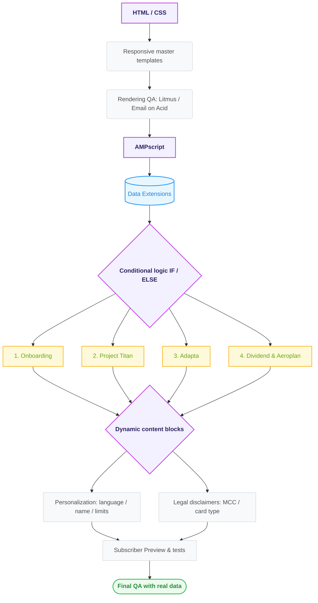
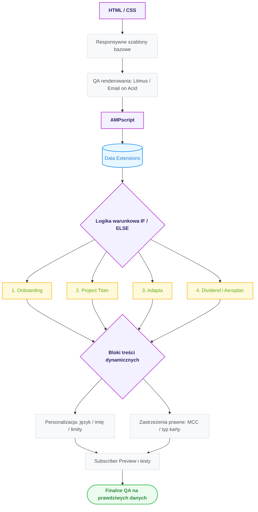

# **Email Marketing Automation for CIBC — Case Study Portfolio**

<p align="center">
  <a href="#english-version">🇬🇧 English Version</a> │ 
  <a href="#wersja-polska">🇵🇱 Wersja Polska</a>
</p>

---

# English Version

<p align="left">
  
  
  
</p>

### 🚀 **What this project is**

A set of personalized email campaigns I built for **CIBC**, one of Canada's largest banks. My job was to turn business requirements and legal rules into email templates that automatically adapt their content to each subscriber — their name, language, card type, balance, and the legal disclaimers that apply to them.

Everything was built in **Salesforce Marketing Cloud (SFMC)**, using **AMPscript** to pull subscriber data and decide what each person sees.

---

### 💡 **My role**

I worked as an **Email Developer (Salesforce Marketing Cloud)**. In practice, that meant:

* **Building email templates from scratch** — responsive, table-based HTML with inline CSS that renders correctly in all major email clients, including older versions of Outlook.
* **Connecting templates to data** — using AMPscript functions (`Lookup`, `LookupRows`) to pull subscriber details from Data Extensions: first name, language, card status, credit limit, and more.
* **Writing conditional logic** — `IF/ELSE` rules that show or hide content blocks, buttons, and legal disclaimers depending on the subscriber's profile.
* **Testing with real data** — using SFMC's Subscriber Preview to switch between test records and confirm that personalization, language versions, and masked card numbers all display correctly.
* **Rendering tests** — running every template through **Litmus / Email on Acid** across hundreds of device and email client combinations.

---

### 🛠️ **The 4 campaigns**

#### 1. Onboarding — 4 customer segments
One master template, four different welcome journeys: *Imperial Service* (premium clients), *CIBC staff*, *standard retail clients*, and *Costco card holders*. Each segment sees a different greeting and a different set of benefits — for example, Premium Black Card perks for Imperial Service clients vs. employee banking rates for staff.

#### 2. Project Titan — lifecycle reminders (Costco Mastercard)
An automated email series sent 10, 20, and 25 days after card activation, encouraging people to sign up for online banking and eStatements.
* **Day 10 & 20:** the email detects whether the recipient is more likely a mobile or desktop user and shows either App Store / Google Play buttons or a browser login link.
* **Day 25:** a final reminder with an extra argument — switching to eStatements means no more paper filing or shredding.

#### 3. Adapta — first purchase email
A triggered email sent right after a customer's first purchase with the new Adapta Mastercard. It explains how the points work (1.5 points per dollar in the customer's top 3 spending categories, 1 point everywhere else) and how to redeem them (1,500 points = $10 toward the card balance, or 1,200 points = $10 toward CIBC investments like RRSP/TFSA).

#### 4. Dividend & Aeroplan — summer travel promotion
Promo emails in two waves (*launch* and *reminder*) encouraging travel spending.
* **Dividend (cash back):** 50% extra cash back on travel purchases, capped at $25.
* **Aeroplan (points):** 50% extra points, capped at 2,500, with separate content variants for the three card tiers (*Infinite Privilege*, *Infinite*, *Regular*).

---

### 📈 **Scale & context**

* **Budget:** the campaign operated on a budget of roughly **$50K** — enough that a rendering bug or a wrong disclaimer wasn't a cosmetic issue, but a real financial and compliance risk.
* **Volume:** deployments of up to **100,000 recipients** per send.
* **Bilingual:** every template existed in **English and French**, with the language version selected automatically from the subscriber's language preference.
* **Segmentation via data files:** each subscriber arrived in the send file with a cell code that routed them to the correct email version (e.g., core clients, bank employees, newcomers). The inbound files followed a strict specification — fixed field order, formats, mandatory fields, and allowed values — and records failing validation were rejected before send.

---

### 📄 **Production documentation (PDF previews)**

Final rendered previews (desktop and mobile layouts) for each campaign are in the [`/docs`](docs) folder:

| # | Campaign | Document |
|---|--------|----------|
| 1 | Onboarding — 4 segments | [01_CIBC_Onboarding_Segments_Spec.pdf](01_CIBC_Onboarding_Segments_Spec.pdf) |
| 2 | Project Titan — lifecycle reminders | [02_CIBC_Project_Titan_Lifecycle_Spec.pdf](02_CIBC_Project_Titan_Lifecycle_Spec.pdf) |
| 3 | Adapta — first purchase email | [03_CIBC_Adapta_First_Purchase_Spec.pdf](03_CIBC_Adapta_First_Purchase_Spec.pdf) |
| 4 | Dividend & Aeroplan — travel promotion | [04_CIBC_Dividend_Aeroplan_Travel_Spec.pdf](04_CIBC_Dividend_Aeroplan_Travel_Spec.pdf) |

> Each PDF shows the final email layouts in desktop and mobile versions, including dynamic content placeholders (`<Firstname>`, `<XXXX>`, `<OFFER END DATE>`) and the full set of legal disclaimer variants.

---

### 🎯 **The hard parts — and how I solved them**

* **Personalization at send time.** Name, language, masked card number, current balance, and credit limit are all pulled from Data Extensions the moment the email is sent — nothing is hardcoded.
* **Legal disclaimers.** Banking emails require precise legal footers, and the right one depends on the card the recipient holds. The template automatically picks the correct disclaimer variant (based on Merchant Category Codes and card type) and hides everything that doesn't apply.
* **One template instead of dozens.** Thanks to conditional content blocks, a single master template covers all segments and card variants. Without it, the team would have to maintain dozens of near-identical static copies.
* **Error-proofing.** Bank data feeds aren't always clean. I added fallbacks for empty (`null`) or badly formatted fields, so a broken record never breaks the email or stops the send.

---

### 💻 **Code snippets**

A simplified, anonymized example of the personalization logic (Data Extension and field names changed — production identifiers are not shown):

```ampscript
%%[
VAR @firstName, @lang, @greeting, @cardTier, @rows, @row

SET @lang      = AttributeValue("PrimaryLanguageId")   /* "E" or "F" */
SET @firstName = AttributeValue("FirstName")

/* Fallback: never send "Hi ," when the name field is empty */
IF Empty(@firstName) THEN
  SET @greeting = Iif(@lang == "F", "Bonjour,", "Hello,")
ELSE
  SET @greeting = Iif(@lang == "F",
       Concat("Bonjour ", ProperCase(@firstName), ","),
       Concat("Hi ", ProperCase(@firstName), ","))
ENDIF

/* Pull card data for this subscriber from a Data Extension */
SET @rows = LookupRows("DE_Card_Data", "AccountId", AttributeValue("AccountId"))

IF RowCount(@rows) > 0 THEN
  SET @row      = Row(@rows, 1)
  SET @cardTier = Field(@row, "CardTier", "STANDARD")
ELSE
  /* Safe default if no record is found — the send never breaks */
  SET @cardTier = "STANDARD"
ENDIF
]%%
```

The card tier then drives which content block — and which legal disclaimer — the subscriber sees:

```ampscript
%%[ IF @cardTier == "INFINITE_PRIVILEGE" THEN ]%%
  <!-- premium benefits block + matching disclaimer variant -->
%%[ ELSEIF @cardTier == "INFINITE" THEN ]%%
  <!-- mid-tier benefits block + matching disclaimer variant -->
%%[ ELSE ]%%
  <!-- standard block + default disclaimer -->
%%[ ENDIF ]%%
```

<!-- Screenshots of the actual implementation (anonymized) can go here:
<p align="left">
  
  
</p>
-->

---

### 🛠️ **Tools**

* **HTML / CSS (email-specific):** table-based layouts, inline styles, media queries.
* **AMPscript:** data lookups, conditional blocks, formatting.
* **Salesforce Marketing Cloud:** Content Builder, Data Extensions.
* **Litmus / Email on Acid:** rendering tests across devices and clients.

---

### 📊 **How it all fits together**



<p align="right">
  <a href="#english-version">⬆️ Back to top</a>
</p>

---

# Wersja Polska

<p align="left">
  
  
  
</p>

### 🚀 **Czym jest ten projekt**

Zestaw spersonalizowanych kampanii e-mailowych, które zbudowałam dla **CIBC** — jednego z największych banków w Kanadzie. Moim zadaniem było przełożenie wymagań biznesowych i reguł prawnych na szablony e-maili, które same dopasowują treść do każdego odbiorcy: jego imienia, języka, typu karty, salda i zastrzeżeń prawnych, które go dotyczą.

Wszystko powstało w **Salesforce Marketing Cloud (SFMC)**, z użyciem **AMPscript** do pobierania danych subskrybenta i decydowania, co kto zobaczy.

---

### 💡 **Moja rola**

Pracowałam jako **Email Developer (Salesforce Marketing Cloud)**. W praktyce oznaczało to:

* **Budowanie szablonów e-mail od zera** — responsywny HTML oparty na tabelach, ze stylami inline, który poprawnie wyświetla się we wszystkich głównych klientach poczty, łącznie ze starszymi wersjami Outlooka.
* **Łączenie szablonów z danymi** — funkcje AMPscript (`Lookup`, `LookupRows`) pobierające dane subskrybenta z Data Extensions: imię, język, status karty, limit kredytowy i inne.
* **Pisanie logiki warunkowej** — reguły `IF/ELSE`, które pokazują lub ukrywają bloki treści, przyciski i zastrzeżenia prawne w zależności od profilu odbiorcy.
* **Testy na prawdziwych danych** — Subscriber Preview w SFMC i przełączanie rekordów testowych, żeby sprawdzić, czy personalizacja, wersje językowe i maskowane numery kart wyświetlają się poprawnie.
* **Testy renderowania** — każdy szablon przechodził przez **Litmus / Email on Acid** na setkach kombinacji urządzeń i klientów poczty.

---

### 🛠️ **Cztery kampanie**

#### 1. Onboarding — 4 segmenty klientów
Jeden szablon bazowy, cztery różne ścieżki powitalne: *Imperial Service* (klienci premium), *pracownicy CIBC*, *standardowi klienci detaliczni* i *posiadacze karty Costco*. Każdy segment widzi inne powitanie i inny zestaw korzyści — np. benefity Premium Black Card dla klientów Imperial Service vs. preferencyjne stawki pracownicze dla zatrudnionych w banku.

#### 2. Project Titan — przypomnienia w cyklu życia (Costco Mastercard)
Automatyczna seria e-maili wysyłanych 10, 20 i 25 dni po aktywacji karty, zachęcająca do założenia bankowości internetowej i włączenia eStatements (wyciągów elektronicznych).
* **Dzień 10 i 20:** e-mail rozpoznaje, czy odbiorca to raczej użytkownik mobilny czy desktopowy, i pokazuje albo przyciski App Store / Google Play, albo link do logowania w przeglądarce.
* **Dzień 25:** ostatnie przypomnienie z dodatkowym argumentem — przejście na eStatements to koniec segregowania i niszczenia papierowych wyciągów.

#### 3. Adapta — e-mail po pierwszym zakupie
E-mail wyzwalany automatycznie zaraz po pierwszej transakcji nową kartą Adapta Mastercard. Tłumaczy, jak działają punkty (1,5 punktu za dolara w 3 najczęstszych kategoriach wydatków klienta, 1 punkt za resztę) i jak je wymieniać (1 500 punktów = 10 $ na spłatę karty albo 1 200 punktów = 10 $ na inwestycje CIBC typu RRSP/TFSA).

#### 4. Dividend i Aeroplan — letnia promocja podróżnicza
E-maile promocyjne w dwóch falach (*launch* i *reminder*), zachęcające do wydatków na podróże.
* **Dividend (cash back):** 50% więcej cash backu za zakupy podróżnicze, maksymalnie 25 $.
* **Aeroplan (punkty):** 50% więcej punktów, maksymalnie 2 500, z osobnymi wariantami treści dla trzech poziomów kart (*Infinite Privilege*, *Infinite*, *Regular*).

---

### 📈 **Skala i kontekst**

* **Budżet:** kampania działała w budżecie rzędu **50 tys. $** — przy takiej skali błąd renderowania czy niewłaściwy disclaimer to nie problem kosmetyczny, tylko realne ryzyko finansowe i compliance.
* **Wolumen:** wysyłki do **100 000 odbiorców** na deployment.
* **Dwujęzyczność:** każdy szablon istniał po **angielsku i francusku**, a wersja językowa była dobierana automatycznie na podstawie preferencji subskrybenta.
* **Segmentacja przez pliki danych:** każdy subskrybent trafiał do pliku wysyłkowego z kodem segmentu, który kierował go do właściwej wersji e-maila (np. klienci standardowi, pracownicy banku, nowi klienci). Pliki wejściowe miały ścisłą specyfikację — stałą kolejność pól, formaty, pola obowiązkowe i dozwolone wartości — a rekordy niespełniające walidacji były odrzucane przed wysyłką.

---

### 📄 **Dokumentacja produkcyjna (podglądy PDF)**


| # | Kampania | Dokument |
|---|-------|----------|
| 1 | Onboarding — 4 segmenty | [01_CIBC_Onboarding_Segments_Spec.pdf](01_CIBC_Onboarding_Segments_Spec.pdf) |
| 2 | Project Titan — przypomnienia w cyklu życia | [02_CIBC_Project_Titan_Lifecycle_Spec.pdf](02_CIBC_Project_Titan_Lifecycle_Spec.pdf) |
| 3 | Adapta — e-mail po pierwszym zakupie | [03_CIBC_Adapta_First_Purchase_Spec.pdf](03_CIBC_Adapta_First_Purchase_Spec.pdf) |
| 4 | Dividend i Aeroplan — promocja podróżnicza | [04_CIBC_Dividend_Aeroplan_Travel_Spec.pdf](04_CIBC_Dividend_Aeroplan_Travel_Spec.pdf) |

> Każdy PDF pokazuje finalne layouty e-maili w wersji desktop i mobile, wraz z placeholderami treści dynamicznych (`<Firstname>`, `<XXXX>`, `<OFFER END DATE>`) i pełnym zestawem wariantów zastrzeżeń prawnych.

---

### 🎯 **Co było trudne — i jak to rozwiązałam**

* **Personalizacja w momencie wysyłki.** Imię, język, maskowany numer karty, saldo i limit kredytowy są pobierane z Data Extensions dokładnie w chwili wysyłki — nic nie jest wpisane na sztywno.
* **Zastrzeżenia prawne.** E-maile bankowe wymagają precyzyjnych stopek prawnych, a właściwa zależy od karty odbiorcy. Szablon sam dobiera odpowiedni wariant (na podstawie kodów MCC i typu karty) i ukrywa wszystko, co nie dotyczy danej osoby.
* **Jeden szablon zamiast dziesiątek.** Dzięki blokom treści warunkowych jeden szablon bazowy obsługuje wszystkie segmenty i warianty kart. Bez tego zespół musiałby utrzymywać dziesiątki niemal identycznych statycznych kopii.
* **Odporność na błędy.** Dane z systemów bankowych nie zawsze są czyste. Dodałam fallbacki dla pustych (`null`) lub źle sformatowanych pól, żeby uszkodzony rekord nigdy nie zepsuł e-maila ani nie zatrzymał wysyłki.

---

### 💻 **Fragmenty kodu**

Uproszczony, zanonimizowany przykład logiki personalizacji (nazwy Data Extensions i pól zostały zmienione — identyfikatory produkcyjne nie są pokazane):

```ampscript
%%[
VAR @firstName, @lang, @greeting, @cardTier, @rows, @row

SET @lang      = AttributeValue("PrimaryLanguageId")   /* "E" lub "F" */
SET @firstName = AttributeValue("FirstName")

/* Fallback: nigdy nie wysyłamy "Hi ," gdy pole imienia jest puste */
IF Empty(@firstName) THEN
  SET @greeting = Iif(@lang == "F", "Bonjour,", "Hello,")
ELSE
  SET @greeting = Iif(@lang == "F",
       Concat("Bonjour ", ProperCase(@firstName), ","),
       Concat("Hi ", ProperCase(@firstName), ","))
ENDIF

/* Pobranie danych karty subskrybenta z Data Extension */
SET @rows = LookupRows("DE_Card_Data", "AccountId", AttributeValue("AccountId"))

IF RowCount(@rows) > 0 THEN
  SET @row      = Row(@rows, 1)
  SET @cardTier = Field(@row, "CardTier", "STANDARD")
ELSE
  /* Bezpieczna wartość domyślna, gdy brak rekordu — wysyłka nigdy się nie wywala */
  SET @cardTier = "STANDARD"
ENDIF
]%%
```

Poziom karty decyduje następnie, który blok treści — i który wariant zastrzeżenia prawnego — zobaczy subskrybent:

```ampscript
%%[ IF @cardTier == "INFINITE_PRIVILEGE" THEN ]%%
  <!-- blok korzyści premium + dopasowany wariant disclaimera -->
%%[ ELSEIF @cardTier == "INFINITE" THEN ]%%
  <!-- blok korzyści średniego poziomu + dopasowany wariant disclaimera -->
%%[ ELSE ]%%
  <!-- blok standardowy + domyślny disclaimer -->
%%[ ENDIF ]%%
```

<!-- Tutaj mogą trafić screenshoty faktycznej implementacji (zanonimizowane):
<p align="left">
  
  
</p>
-->

---

### 🛠️ **Narzędzia**

* **HTML / CSS (pod e-mail):** layouty oparte na tabelach, style inline, media queries.
* **AMPscript:** pobieranie danych, bloki warunkowe, formatowanie.
* **Salesforce Marketing Cloud:** Content Builder, Data Extensions.
* **Litmus / Email on Acid:** testy renderowania na urządzeniach i klientach poczty.

---

### 📊 **Jak to się składa w całość**



<p align="right">
  <a href="#wersja-polska">⬆️ Powrót na górę</a>
</p>
